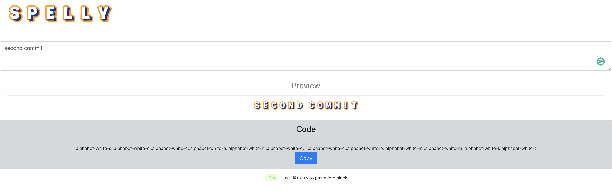
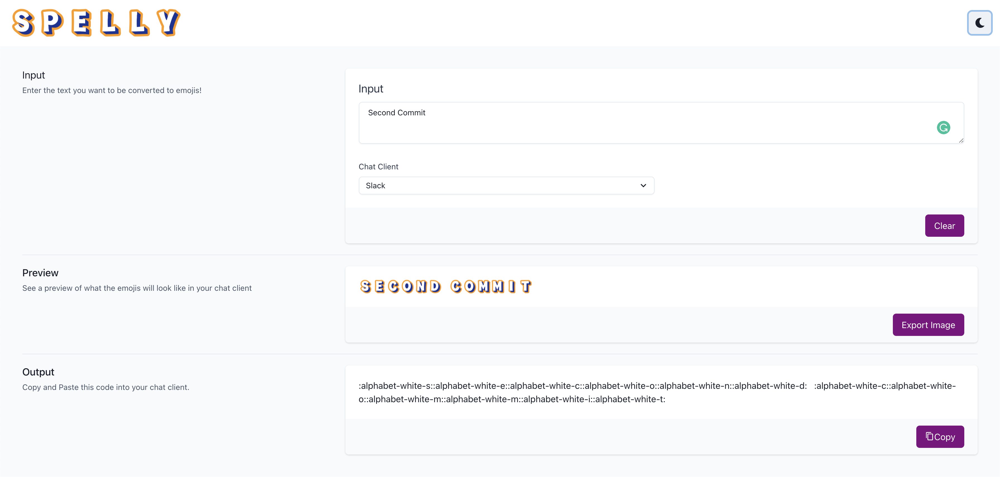
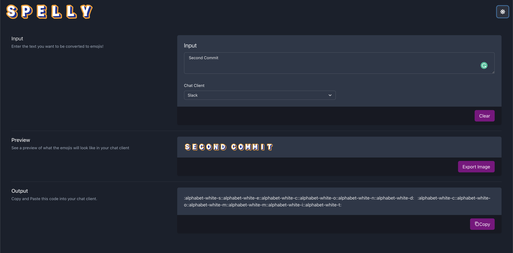
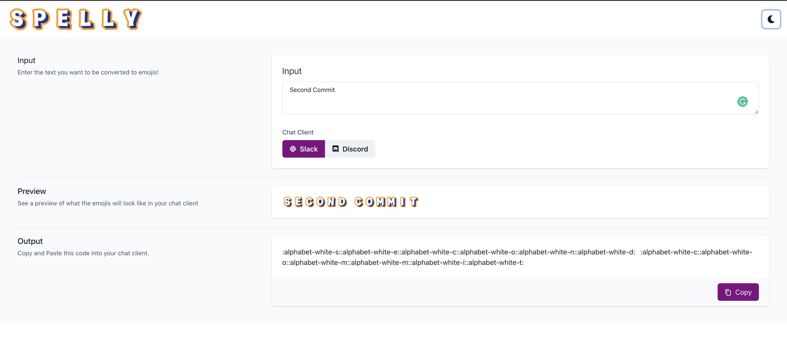
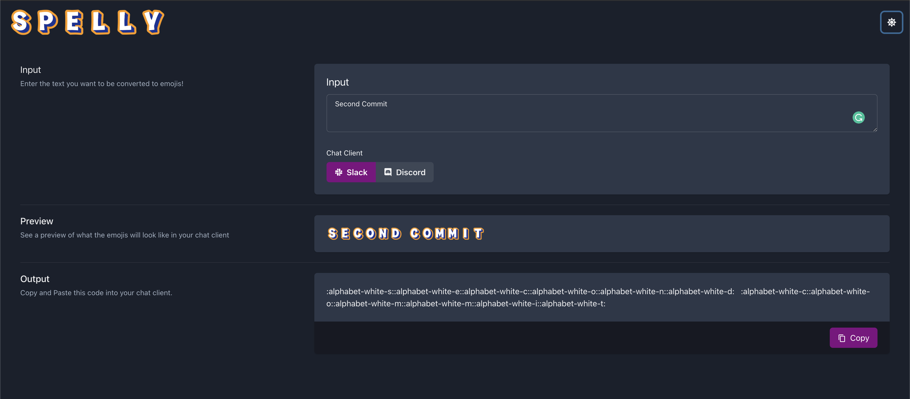
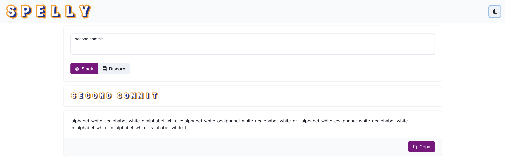
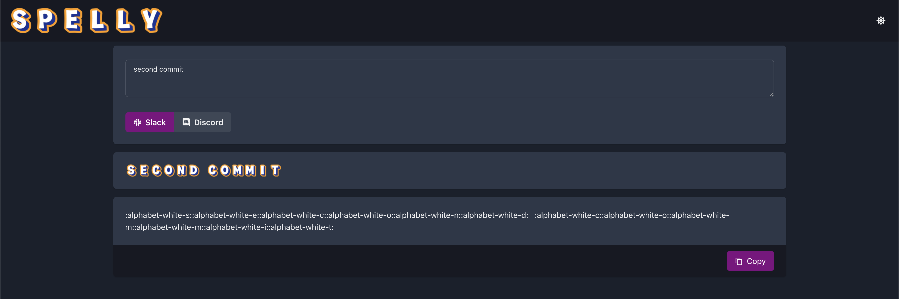

# Evolution of Spelly UI

This document tracks how and why the UI of Spelly has changed

## First crack at Bootstrap

### Critique of UI
- :heavy_check_mark: Simple layout, one text box, one button, everything else clearly not intractable
- :x: No visual separation between Input and Preview
- :interrobang: Too wide or simply using all the screen real estate?

### Impression of Bootstrap 
- :heavy_check_mark: Good examples of a bunch of different elements in the [docs](https://getbootstrap.com/docs/5.0/components/buttons/) 
- :heavy_check_mark: Lots of StackOverflow content
- :x: have to "View Page Source" to see how all the [example templates](https://getbootstrap.com/docs/5.0/examples/) were made
- :x: Feels a lot like writings CSS still
- :x: Everything has to go into one big long `className='blah foo bar'` string instead of named properties

## Swap to Chakra styled components

| Light |  Dark |
| ----- | ----- |
|   |    |

### Critique of UI
- :heavy_check_mark: dark/light theme swapping
- :heavy_check_mark: more consistent spacing and content locations
- :x: more buttons and features that no one asked for
- :x: Only the `Input` form has a right-column header, everything else is explained only on the left
- :x: The icon for swapping from light->dark kinda looks like a Settings `Gear Icon`

### Impression of ChakraUI
- :heavy_check_mark: Built-in dark/light theme swapping support via [useColorMode](https://chakra-ui.com/docs/features/color-mode#setup)
- :heavy_check_mark: Nicely organized [docs](https://chakra-ui.com/docs/form/button#import) with visual examples followed by code snippet
- :heavy_check_mark: Useful, elegant looking component library from community member for inspiration [choc-ui.tech](https://choc-ui.tech/)  
- :heavy_check_mark: Named properties for all the CSS properties being applied to a component
- :x: smaller community and StackOverflow content
- :heavy_check_mark: Active community on Discord

## Button group for chat client and remove upper buttons

| Light |  Dark |
| ----- | ----- |
|   |    |

### Critique of UI
- :heavy_check_mark: removed hidden knowledge of which chat clients are supported by swaping drop-down for button group where all choices are visible
- :x: The Input/Preview/Output headings eat a lot of vertical space on mobile and you have to scroll to see the copy button
- :heavy_check_mark: Less buttons make the UI cleaner and keeps the focus on the core feature of Spelly

## Simplify UI by removing side panels

| Light |  Dark |
| ----- | ----- |
|   |    |

### Critique of UI
- :heavy_check_mark: Remove side panel helper text that explained the obvious purpose each element
- :heavy_check_mark: Remove section separators and rely on drop-shadow to lighten the page
